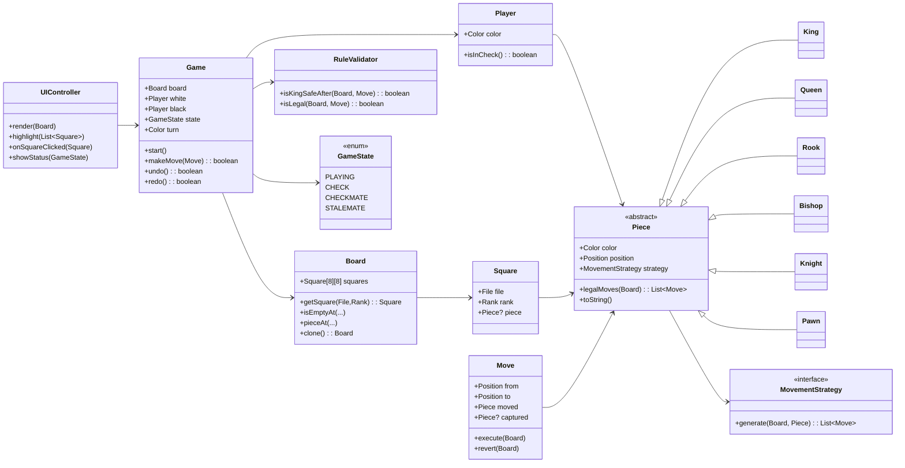

# Chess Game (Java + JavaFX)

A clean, object-oriented **Chess** implementation built in **Java** with a **JavaFX** GUI. The design follows **SOLID** principles and classic **Design Patterns**, organized around the **OODA** loop *(Observe → Orient → Decide → Act)* to structure UI updates, rules evaluation, move selection, and execution.

---

## ✨ Features

* **Full chess rules**: legal moves, check / checkmate detection, castling, en-passant, pawn promotion.
* **Undo/Redo** via Command pattern (move history).
* **Highlights & hints**: show selectable pieces and legal target squares.
* **Turn system** with game states (playing, check, checkmate, stalemate).
* **Modular rules engine**: per-piece movement strategies; validators for check safety.
* **Extensible UI**: JavaFX views separated from domain model.

> If any rule is not yet implemented in your local copy, keep the section and track completion in the roadmap below.

---

## 🧱 Architecture Overview



### Key Patterns

* **Strategy** — `MovementStrategy` per piece (rook, bishop, knight…).
* **Command** — `Move.execute/revert` supports **Undo/Redo**.
* **State** — `GameState` drives UI messages & flow (PLAYING, CHECK…).
* **Observer (pub/sub)** — model → UI updates (e.g., via listeners/bindings).
* **Factory** — piece creation from FEN / initial setup.

---

## 🛠 Prerequisites

* **JDK 17+** installed (`java -version`)
* **JavaFX 17+**

  * If you don’t use Maven/Gradle, download JavaFX SDK and set `--module-path` VM option when running.

> If you already ship JavaFX via Maven/Gradle or use a JDK bundle with FX, follow the relevant section below.

---

## ▶️ How to Run

### Option A — IntelliJ IDEA (fastest)

1. **Open the project** (`File → Open → project root`).
2. **Project SDK**: set to **JDK 17+**.
3. **Add JavaFX**:

   * Download JavaFX SDK (if not using Maven/Gradle).
   * Run configuration → **VM options**:

     ```
     --module-path /path/to/javafx-sdk-17/lib --add-modules javafx.controls,javafx.fxml
     ```
4. **Run** the main class (e.g., `Main` / `App`).

### Option B — Maven (if `pom.xml` exists)

```bash
mvn clean javafx:run
# or, if not using the javafx-maven-plugin:
mvn clean package
java -jar target/chess-game.jar
```

**Add plugin (if needed):**

```xml
<plugin>
  <groupId>org.openjfx</groupId>
  <artifactId>javafx-maven-plugin</artifactId>
  <version>0.0.8</version>
  <configuration>
    <mainClass>your.package.Main</mainClass>
    <launcher>launcher</launcher>
    <jlinkZip>true</jlinkZip>
    <jlinkImageName>chess</jlinkImageName>
    <stripDebug>true</stripDebug>
    <noManPages>true</noManPages>
    <noHeaderFiles>true</noHeaderFiles>
    <addModules>
      <addModule>javafx.controls</addModule>
      <addModule>javafx.fxml</addModule>
    </addModules>
  </configuration>
</plugin>
```

### Option C — Gradle (if `build.gradle` exists)

```bash
./gradlew run
# or
./gradlew build
java -jar build/libs/chess-game.jar
```

**Kotlin DSL example (add if needed):**

```kotlin
plugins {
  application
  id("org.openjfx.javafxplugin") version "0.1.0"
}
application {
  mainClass.set("your.package.Main")
}
javafx {
  version = "17"
  modules = listOf("javafx.controls", "javafx.fxml")
}
```

### Option D — CLI (no build tool)

```bash
# compile
javac --module-path /path/to/javafx-sdk-17/lib --add-modules javafx.controls,javafx.fxml \
  -d out $(find src -name "*.java")

# run
java --module-path /path/to/javafx-sdk-17/lib --add-modules javafx.controls,javafx.fxml \
  -cp out your.package.Main
```

---

## 🎮 Controls & Gameplay

* **Click** a piece to select; legal target squares are **highlighted**.
* **Click target square** to move; illegal targets are ignored.
* **Right-click / ESC** to cancel selection.
* **Promotion**: choose piece (Queen/Rook/Bishop/Knight) when a pawn reaches the last rank.
* **Undo / Redo** (if wired to menu/shortcuts): `Ctrl+Z` / `Ctrl+Y`.

---

## 📦 Project Structure (typical)

```
chess_Game/
└─ src/
   └─ your/package/...
      ├─ Main.java                # JavaFX app entry
      ├─ ui/                     # JavaFX controllers, FXML, view models
      ├─ model/                  # Board, Square, Piece hierarchy
      ├─ engine/                 # Move generator, validators, check detection
      ├─ rules/                  # Strategies for piece movement
      ├─ command/                # Move command + history
      └─ util/                   # FEN parser, helpers
```

> If your actual package names differ, keep the roles the same.

---

## ✅ Testing (suggested)

* **Unit tests**: per-piece strategy, check detection, stalemate.
* **Property tests**: move → undo → state equality.
* **FEN suites**: load known positions and expected legal moves count.

Example (JUnit 5):

```java
@Test
void kingCannotMoveIntoCheck() {
  Board board = Fen.load("8/8/8/8/8/8/4k3/4Q3 w - - 0 1"); // white to move
  Piece king = board.findKing(Color.WHITE);
  List<Move> moves = king.legalMoves(board);
  assertTrue(moves.stream().noneMatch(m -> RuleValidator.isKingSafeAfter(board, m) == false));
}
```

---

## 📈 Roadmap

* [ ] Perft tests (divide nodes)
* [ ] Threefold repetition / 50-move rule
* [ ] PGN export/import
* [ ] Timers (blitz/classic)
* [ ] AI opponent (minimax + alpha-beta, iterative deepening)
* [ ] Online play (WebSocket)

---

## 🧭 OODA in Practice

* **Observe**: UI listens to board/turn changes; highlights legal moves.
* **Orient**: engine evaluates position & filters illegal moves (king safety).
* **Decide**: user selects a move; AI (future) picks via search.
* **Act**: execute `Move` command → update board → push to history → notify UI.

---

## 🤝 Contributing

* Keep PRs focused (one feature/fix).
* Follow **SOLID**; prefer strategies over flags.
* Tests first for rules; ensure **undo/redo** remains correct.

---
